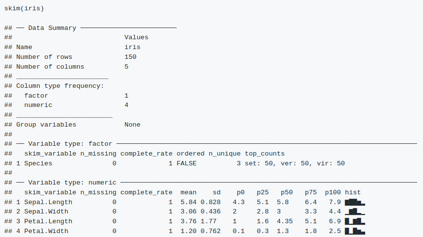

```{r opts, echo = FALSE}
knitr::opts_chunk$set(
    echo = FALSE, message = FALSE, warning = FALSE,
    cache = 2,
    cache.path = "cache_explore/",
    dev = "png",
    out.width = "500px",
    dpi = 300,
    dev.args = list(
        type = "cairo-png"
    ),
    fig.path = "figure_exp/"
)
library("ggplot2")
theme_set(theme_bw())
```


# What will we cover today?

- What does it mean to explore data and why do we do it?

- What types of data do we deal with?

- How can we numerically summarise data?

- How can we graphically summarise data?

- What are some pitfalls of exploring data?

- What resources exist to help you to explore data?


```{r, eval = FALSE}
- What do I mean by exploring data?
- Why is it important?
- What should we be wary of when exploring our data?
https://en.wikipedia.org/wiki/Pareidolia
- Types of data
- Summary statistics
    - missing values
    - continuous:
        - mean, median, variance/sd, quantiles
        - Correlation
    - discrete:
        - count/frequency, mode
        - crosstable
- Basic plots
    - 1d:
        - continuous:
            - histogram/density
        - discrete:
            - barchart
    - 2d:
        - continuous:
            - scatter plot
            - violin plot/boxplot (not dynamite)
        - discrete:
            - bar chart (dodge/fill, %age or not)
            - mosaic plot
    - 3d+:
        - dotplots
        - heatmaps
        - widgets
- PCA (mention nonlinear)
```

```{r}
library("GenomicDataCommons")
resp <- cases() %>%
    GenomicDataCommons::filter(~ project.project_id=='TCGA-COAD') %>%
    ids() %>%
    gdc_clinical()
exposures <- resp$exposures
demographic <- resp$demographic
```

---

# What **won't** we cover today?

- How can we deal problems we find in data?

- How do we know which statistical models to apply?

- How can we formally identify structure in data?

- How can we deal with complex structure in data?

- How can we compress high-dimensional data? (PCA)


---

# What does it mean to explore data?

Exploring data is the process of summarising and visualising different
aspects of the data in order to gain an understanding of its structure,
to help us plan later analysis steps.

It is a key part of data analysis in scientific research.


```{r, out.width = "500px"}
# 

```


---

# Why is it important to explore data?

By exploring the data effectively, we can make our analysis time more 
efficient and effective!


```{r, out.width = "400px"}

```

---

# What does it mean to explore data?

We don't perform lab experiments without knowing that it makes 
sense for our hard-earned samples.

We shouldn't perform a statistical analysis unless
we can be sure that it make sense for our hard-earned data.

```{r, out.width = "200px"}
knitr::include_graphics("figure/xkcd_cells.png")
```

---

# Why is it important to explore data?

We often have some expectations about what the data will look like:
- Possible values for assays (eg, no negative fluorescence)
- Range of plausible values (eg, no 150 year old people)

It's important that we satisfy these expectations, or at least understand why
they are violated.

```{r, out.width = "500px"}

```

---

# Why is it important to explore data?

If we don't explore the data, we may miss key relationships
within the data. For example, strong confounding may make interpretation 
difficult or even impossible!

This allows us to spot problems with experimental design, though it may not
be possible to correct for them.

```{r, out.width = "300px", fig.width = 5, fig.height = 5}
time_of_day <- rnorm(100)
drug <- time_of_day + rnorm(100, sd=0.5)
outcome <- -2 * drug + rnorm(100, sd = 0.5)
plot(drug, outcome, pch = 16)
```
--
```{r, out.width = "300px", fig.width = 5, fig.height = 5}
plot(drug, time_of_day, pch = 16)
```

---

# Why is it important to explore data?

If we don't understand the structure of the data, we will not know how
to analyse it effectively.

```{r, fig.width = 4, fig.height = 3}
n <- 40
m1 <- 0
m2 <- 5
df <- data.frame(
    condition = c(
        sample(letters[1:2], n / 2, replace = TRUE, prob = c(0.7, 0.3)),
        sample(letters[1:2], n / 2, replace = TRUE, prob = c(0.3, 0.7))
    ),
    batch = c(
        rep("1", n / 2),
        rep("2", n / 2)
    ),
    x = c(rnorm(n / 2, m1, 0.5), rnorm(n / 2, m2, 0.5)),
    y = rnorm(n)
)
ggplot(df, aes(x, y, colour = condition)) +
    geom_point() +
    theme(
        axis.text = element_blank(),
        axis.ticks = element_blank(),
        axis.title = element_blank()
    )
```

---

# Why is it important to explore data?

If we don't understand the structure of the data, we will not know how
to analyse it effectively.

```{r, fig.width = 4, fig.height = 3}
ggplot(df, aes(x, y, colour = condition, shape = batch)) +
    geom_point() +
    theme(
        axis.text = element_blank(),
        axis.ticks = element_blank(),
        axis.title = element_blank()
    )
```

---

# Why is it important to explore data?

Data often contain unusual or unexpected observations and complex 
relationships between the measurements or assays recorded.

If we understand these before performing analysis, we can avoid making spurious
findings.

Comic by [Ben Shabad](http://davidmlane.com/ben/cartoons.html).

```{r, out.width = "80%"}

```


---

# How can we explore data?

In order to understand the properties and structure of the data,
we want to reduce the complexity to a form
that we can easily understand.  

We can use **descriptive statistics** and **plots** to reduce the complexity
of the data to a form that we can gradually and easily explore.

```{r, out.width = "300px"}

```

```{r, out.width = "300px", fig.width = 4, fig.height = 2.8}
## https://bioinformatics.stackexchange.com/questions/11222/stacked-bargraph-with-error-bars
celltype_df <- data.frame(
    Cell_Type = c("Fibroblast", "T cell", "Macrophage", 
        "Tumor", "Islets of Langerhans", "Endothelial", "B cell", "Fibroblast", 
        "T cell", "Macrophage", "Tumor", "Islets of Langerhans", "Endothelial", 
        "B cell"
    ),
    Condition = c("treated", "treated", "treated", "treated", 
        "treated", "treated", "treated", "untreated", "untreated", "untreated", 
        "untreated", "untreated", "untreated", "untreated"
    ),
    Freq = c(6051L, 1892L, 1133L, 657L, 116L, 868L, 832L, 5331L, 3757L, 1802L,
        835L, 287L, 704L, 256L
    ),
    Percent = c(52.39, 16.38, 9.81, 5.69, 1, 7.52, 7.2, 41.1, 28.96, 13.89,
        6.44, 2.21, 5.43, 1.97
    )
)
# ggplot(celltype_df, aes(x = Condition, y = Percent, fill = Cell_Type)) +
#     geom_bar(stat = "identity") +
#     scale_fill_brewer(palette = "Set1")
```

---

# Types of data

- Categorical:
    - nominal 
    - ordinal 

- Numeric:
    - discrete 
    - continuous 
---

# Nominal categorical data

Fixed, mutually exlusive categories with no inherent order 
(ie, no category is "larger" or "greater" than another). Examples:

- Place of employment/education

- Mouse breeds

```{r, out.width = "350px"}
knitr::include_graphics("figure/mousebreeds.jpg")
```

---

# Ordinal categorical data

Fixed categories with inherent ordering. The "distance" between categories is
not quantitative or consistent. Examples:

- Education level (none, primary, secondary, etc)

- Cancer stage/grade

- Likert scale (graded response questionnaire)

```{r, out.width = "300px"}

```

---

# Discrete numeric data

Countable set of possible values (eg, whole numbers). Size of set can be
infinite. Distance between categories is quantifiable. Examples:

- Number of children/offspring

- Number of tumours per mouse

- Number of RNA molecules sequenced per sample/per cell

- Number of gears in a car's gearbox

```{r, out.width = "350px", fig.width = 5, fig.height = 4}
ggplot(mtcars, aes(factor(gear))) + geom_bar() + xlab("Gears") + ylab("Cars")
```

---

# Continuous numeric data

Infinite and uncountable number of possible values.
May still have upper and/or lower bounds on range. Examples:

- Height

- Weight

- Fluorescence/qPCR readout

- Tumour size

```{r, out.width = "300px", fig.width = 4, fig.height = 3}
hist(
    iris$Petal.Length,
    breaks = "FD",
    main = "Histogram of Iris Petal Length",
    xlab = "Petal length"
)
```

---

# Sample versus population

In a census, the state attempts to measure and study the entire population.

In almost every scientific study, we can only deal with a sample from the total
population due to cost and time constraints.

We aim to use a sample that is representative of the entire population.

```{r, out.width = "300px"}

```

---

# Descriptive statistics

Descriptive statistics are a way to numerically summarise the information
available in the data.

Statistical inference, in contrast, attempts to
use information from the sample to inform us about the properties
of the population.

```{r, out.width = "400px", fig.width = 5, fig.height = 4}
x <- rnorm(10)
ggplot() + aes(seq_along(x), x) + 
    geom_point() + 
    geom_hline(
        aes(
            yintercept = c(min(x), mean(x), max(x)),
            colour = c("Minimum", "Mean", "Maximum")
        )
    ) +
    scale_colour_brewer(palette = "Set1", name = "Value") +
    theme(
        axis.text = element_blank(),
        axis.ticks = element_blank(),
        axis.title = element_blank()
    )
```

---

# Descriptive statistics (categorical)

For categorical data, the main form of data summary is a count and/or frequency 
table.

For ordinal data, it may make sense to include cumulative count or proportion.

```{r}
iris_species <- iris$Species
library("janitor")
knitr::kable(format(tabyl(iris_species), digits = 2), "html")
```


---

# Descriptive statistics (numeric)

We cannot generally use frequency tables unless we categorise the data.

```{r}
height <- cut(
    exposures$height,
    quantile(exposures$height, na.rm = TRUE, c(0, 0.33, 0.66, 1))
)
height <- na.omit(height)
levels(height) <- paste(c("Short", "Medium", "Tall"), levels(height))
knitr::kable(format(tabyl(height), digits = 2), "html")
```

--


This can lead to many problems and questions.  
For example:
- How do we choose how many categories?

- Where do place the boundaries between them?

---

# Descriptive statistics (numeric)

Instead of frequency tables, for numerical data we usually try to use summary 
measures:

- mean

- median

- mode

- variance

- quantiles


---

# Measures of location

We can use a few different statistics to measure the "location" of a variable.

**Mean**, $\bar{x}$:

$\bar{x} = \frac{x_1 + x_2 + \dots + x_n}{n}$

--

**Median**, $x_{50\%}$:  
the midpoint of the data, such that 50% of observations lie below 
the median.

--

**Mode**:
The most common or most probable value. 

--

```{r, out.width = "350px"}
knitr::include_graphics("figure/mean_median_mode.png")
```

---

# Mean and median

Often, the median and mean of a variable are very similar.

```{r}
h <- exposures$height[complete.cases(exposures$height)]
hs <- h[141:150]
hs2 <- hs
hs2[[4]] <- rnorm(1, hs[[2]])
hs2 <- round(hs2, digits = 1)
dput(hs2)
```

**Mean**, $\bar{x}$ = `r mean(hs2)`

**Median**, $x_{50\%}$ = `r median(hs2)`

--
  
  
What if the data change, so we have one unusual value?

```{r}
dput(hs)
```

**Mean**, $\bar{x}$ = `r mean(hs)`

**Median** $x_{50\%}$ = `r median(hs)`

Median is a more *robust* measure of the location of a variable.

---


# Quantiles

We showed that the median, $x_{50\%}$, is the midpoint of the data, such
that 50% of observations lie below $x_{50\%}$.

$x_{25\%}$ and $x_{75\%}$ are the lower and upper quartiles, respectively.


```{r, out.width = "400px", fig.width = 5, fig.height = 4}
x <- rnorm(1000)
q <- quantile(x)
ggplot() + aes(seq_along(x), x) +
    geom_hline(
        aes(yintercept = q, color = names(q)),
        size = 2
    ) +
    geom_point(alpha = 0.5) +
    scale_color_brewer(
        palette = "Set2",
        name = "Quantile",
        limits = c("0%", "25%", "50%", "75%", "100%")
    ) +
    theme(axis.title = element_blank(),
        axis.text.x = element_blank(),
        axis.ticks.x = element_blank())
```

---


# Measures of variability (scale)

It is also important to measure the variability of a variable around its mean.
Again, there are several statistics we can use to quantify this:

**Variance**, $\text{var}(x)$:

$\text{var}(x) = \frac{(x_1 - \bar{x})^2 + \dots + (x_n - \bar{x})^2}{n}$

**Standard deviation**, $\text{sd}(x)$:

$\text{sd}(x) = \sqrt{\frac{(x_1 - \bar{x})^2 + \dots + (x_n - \bar{x})^2}{n}}$

**Interquartile range**, $\text{IQR}(x)$

$\text{IQR}(x) = x_{75\%} - x_{25\%}$


---

# Two variable summaries

In addition to univariate descriptive statistics, we can summarise the
relationship between two variables.

For categorical variables, a frequency/count table can be generalised to two
or more variables:

```{r}
knitr::kable(tabyl(demographic, gender, vital_status, show_na = FALSE), "html")
```

These are also known as *contingency* tables.

---

# Correlation (Pearson)

Correlation is a measure of how the value of one variable relates
to the value of another.

Pearson correlation quantifies how close the relationship between two variables
is to being exactly linear.


```{r, out.width = "500px"}
knitr::include_graphics("figure/Correlation_examples2.png")
```

A nice visualisation of Pearson correlation can be found at the link below:  
https://shiny.rit.albany.edu/stat/rectangles/

---

# Correlation (Spearman)

While Pearson correlation how close the relationship between variables is
to linear, Spearman correlation performs this on the *ranks* of the variables.

This means that it captures non-linear relationships, while Pearson correlation
does not.

It is also less sensitive to outlying observations.

```{r, out.width = "350px", fig.width = 4, fig.height = 3}
set.seed(42)
x <- rnorm(100)
y <- x * 2 + rnorm(100, 0.5)
cp1 <- round(cor(x, y, method = "pearson"), digits = 2)
cp2 <- round(cor(x, y, method = "spearman"), digits = 2)
ggplot() +
    geom_point(aes(x, y)) +
    geom_text(
        aes(
            x = c(min(x), min(x)) + 1,
            y = c(max(y), max(y) - 0.75),
            label = paste(c("Pearson:", "Spearman:"), c(cp1, cp2))
        ),
        inherit.aes = FALSE
    ) + 
    theme(axis.text = element_blank(),
        axis.ticks = element_blank(),
        axis.title = element_blank())
```
--
```{r, out.width = "350px", fig.width = 4, fig.height = 3}
x[sample(length(x), 10)] <- x[sample(length(x), 10)] + 4
cp1 <- round(cor(x, y, method = "pearson"), digits = 2)
cp2 <- round(cor(x, y, method = "spearman"), digits = 2)
ggplot() +
    geom_point(aes(x, y)) +
    geom_text(
        aes(
            x = c(min(x), min(x)) + 1.5,
            y = c(max(y), max(y) - 0.75),
            label = paste(c("Pearson:", "Spearman:"), c(cp1, cp2))
        ),
        inherit.aes = FALSE
    ) +
    theme(axis.text = element_blank(),
        axis.ticks = element_blank(),
        axis.title = element_blank())
```

---


```{r, dpi = 70, eval = FALSE}
# Descriptive statistics may not be enough!
# library("dplyr")
# library("tidyr")
library("magrittr")
library("plotly")
df <- tidyr::gather(datasets::anscombe) %>%
    dplyr::mutate(dataset = gsub("[xy](\\d)", "\\1", key)) %>%
    dplyr::mutate(key = gsub("\\d", "", key)) %>%
    dplyr::group_by(key) %>% 
    dplyr::mutate(id=1:dplyr::n()) %>% 
    tidyr::spread(key, value) %>% 
    dplyr::select(-id)
lms <- df %>% 
    group_by(dataset) %>% 
    summarise(
        intercept = broom::tidy(lm(y ~ x))[1, "estimate"][[1]],
        slope = broom::tidy(lm(y ~ x))[2, "estimate"][[1]],
        x = min(df$x),
        xend = max(df$x),
        y = (x * slope) + intercept,
        yend = (xend * slope) + intercept
    )
ax <- list(
    title = "",
    zeroline = FALSE,
    showline = FALSE,
    showticklabels = FALSE,
    showgrid = FALSE
)
plot_ly(df, 
        x = ~x, 
        y = ~y, 
        frame = ~dataset, 
        mode = "markers",
        type = "scatter",
        showlegend = FALSE) %>%
    add_segments(
        data = lms,
        inherit = FALSE,
        x = ~x,
        xend = ~xend,
        y = ~y,
        yend = ~yend,
        frame = ~dataset,
        showlegend = FALSE
    ) %>%
    layout(xaxis = ax, yaxis = ax) %>%
    animation_opts(frame = 2500, transition = 500) %>%
    animation_slider(hide = TRUE)
---
```


# Descriptive statistics may not be enough!

It is easy to miss details when focusing on numeric summaries!

```{r, dpi = 65}
library("datasauRus")
library("plotly")
ax <- list(
    title = "",
    zeroline = FALSE,
    showline = FALSE,
    showticklabels = FALSE,
    showgrid = FALSE
)
datasaurus <- datasaurus_dozen %>%
    dplyr::group_by(dataset) %>%
    dplyr::mutate(
        cor = round(cor(x, y), digits = 2),
        sd_x = round(sd(x), digits = 2),
        sd_y = round(sd(y), digits = 2),
        mean_x = round(mean(x), digits = 2),
        mean_y = round(mean(y), digits = 2)
    ) %>% 
    dplyr::mutate(text = paste(
            "mean_x:", mean_x, "<br>",
            "mean_y:", mean_y, "<br>",
            "sd_x:", sd_x, "<br>",
            "sd_y:", sd_y, "<br>",
            "cor:", cor
        )
    )
datasaurus$dataset %<>% factor(
    levels = c(
        "away", 
        "high_lines", 
        "wide_lines",
        "h_lines", 
        "v_lines",
        "slant_down", 
        "slant_up", 
        "dots",
        "bullseye",
        "circle",
        "star", 
        "x_shape",
        "dino"
    )
)
text <- datasaurus %>% dplyr::group_by(dataset) %>% dplyr::slice(1)
plot_ly(datasaurus) %>%
    add_markers(
        x = ~x, 
        y = ~y, 
        frame = ~dataset, 
        showlegend = FALSE) %>%
    add_text(
        x = 24,
        y = 7,
        text = text$text,
        frame = text$dataset
    ) %>%
    layout(xaxis = ax, yaxis = ax) %>%
    animation_opts(frame = 2500, transition = 500) %>%
    animation_slider(hide = TRUE)
```

---

# Bar plots (categorical)

A useful way to visualise a contingency table is via a bar chart:

```{r, fig.width = 5, fig.height = 4}
gender_vital_df <- reshape2::melt(
    tabyl(demographic, gender, vital_status),
    na.rm = TRUE
)
gender_vital_df <- gender_vital_df[gender_vital_df$variable != "NA_", ]
gender_vital_df <- gender_vital_df[!is.na(gender_vital_df$gender), ]
ggplot(gender_vital_df) +
    geom_bar(
        aes(x = gender, y = value, fill = variable),
        stat = "identity",
        na.rm = TRUE) +
    labs(y = "Count") +
    scale_fill_brewer(palette = "Set1", name = "Vital status")
```

---

# Bar plots (categorical)

For skewed data, proportions may be more informative.

```{r, fig.width = 5, fig.height = 4}
ggplot(gender_vital_df) +
    geom_bar(
        aes(x = gender, y = value, fill = variable),
        stat = "identity",
        position = "fill",
        na.rm = TRUE) +
    labs(y = "Proportion") +
    scale_fill_brewer(palette = "Set1", name = "Vital status")
```

---

# Mosaic plots (categorical)

When the categories are uneven or contain many levels, it may be useful to 
use a mosaic plot instead of a bar chart. Here, bar width represents category 
size.

```{r, fig.width = 6, fig.height = 4.5}
library("ggmosaic")
ggplot(demographic) +
    geom_mosaic(
        aes(x = ggmosaic::product(vital_status), fill = race),
        na.rm = TRUE) +
    scale_fill_brewer(palette = "Set1", name = "Race") +
    labs(x = "Vital status", y = "Race")
```
---


# Histograms and density plots (numeric)

A histogram is a binned representation of numeric data. It's important to 
consider the number and location of the bins, as these figures can be 
misleading.

Kernel density estimates are similar, but use a smooth representation rather
than discrete bins.

Both are *highly* sensitive to parameters adjusting the resolution of the 
visualisation.

```{r, out.width = "300px", fig.width = 5, fig.height = 4}
# http://freerangestats.info/blog/2020/04/06/crazy-fox-y-axis
hist(exposures$bmi, breaks = "FD", xlab = "BMI", main = "Histogram of BMI")
```
--
```{r, out.width = "300px", fig.width = 5, fig.height = 4}
# http://freerangestats.info/blog/2020/04/06/crazy-fox-y-axis
plot(density(exposures$bmi, na.rm = TRUE),
    xlab = "BMI",
    main = "Kernel density estimate of BMI"
)
```

---

# Dynamite plots (numeric vs categorical)

Bar plots or "dynamite plots" are very common in the biological sciences.  
However they suffer from a number of serious flaws and several superior methods 
to represent numeric data across categories.

```{r, out.width = "400px"}

```

```{r, out.width = "400px", fig.height = 4, fig.width = 5}
exposure_demographic <- merge(exposures, demographic, by = "case_id")

d2 <- exposure_demographic %>%
    dplyr::group_by(race) %>%
    dplyr::summarise(
        weight_ = mean(weight, na.rm = TRUE),
        sd = sd(weight, na.rm = TRUE)
    )
d2$weight <- d2$weight_
d2 <- d2[-c(1, 2, 4), ]
ggplot(d2) +
    aes(race, weight) +
    geom_bar(stat = "identity", fill = "grey80") +
    geom_errorbar(
        aes(ymin = weight - sd,
            ymax = weight + sd),
            width = 0.1)
```

---


# Boxplot  (numeric vs categorical)

A boxplot shows the median, quartiles, and a region 1.5 times the IQR.
Outlying points beyond this range are also shown.

```{r, fig.height = 4, fig.width = 5}
e2 <- exposure_demographic[exposure_demographic$race %in% d2$race, ]
e3 <- e2 %>% group_by(race) %>%
    summarise(
        q1 = quantile(weight, probs = 0.25, na.rm = TRUE),
        q2 = quantile(weight, probs = 0.5, na.rm = TRUE),
        q3 = quantile(weight, probs = 0.75, na.rm = TRUE)
    )
e3f <- reshape2::melt(e3)
e3f$expression <- sapply(as.character(e3f$variable),
    function(x) {
        switch(
            x,
            "q1" = bquote(x[25~'%']),
            "q2" = bquote(x[50~'%']),
            "q3" = bquote(x[75~'%'])
        )
    }
)
ggplot(e2) +
    aes(race, weight) +
    geom_boxplot(na.rm = TRUE, fill = "grey80") +
    geom_text(data = e3f,
        aes(x = race,
            y = value,
            label = expression
        ),
        nudge_x = - 0.5,
        parse = TRUE
    )
```

---

# Violin plot (numeric vs categorical)

Violin plots present kernel density estimates for multiple groups.

```{r, fig.height = 4, fig.width = 5}
ggplot(e2) +
    aes(race, weight) +
    geom_violin(na.rm = TRUE, fill = "grey80")
```
---

# Combinations (numeric vs categorical)

It is often useful to use a combination of the plots shown so far to represent 
numeric data split across categories; it helps us understand the data.

```{r, out.width="350px", fig.height = 5, fig.width = 4}
ggplot(e2) +
    aes(race, weight) +
    geom_violin(na.rm = TRUE, fill = "grey80") +
    geom_jitter(height = 0, width = 0.2)
```
--
```{r, out.width="350px", fig.height = 5, fig.width = 4}
ggplot(e2) +
    aes(race, weight) +
    geom_violin(na.rm = TRUE, fill = "grey80") +
    geom_boxplot(outlier.color = NA, width = 0.1, na.rm = TRUE)
```


---

# Scatter plots (numeric vs numeric)

Plotting two variables is often more informative about outliers
and the relationship between variables than examining descriptive statistics.


```{r, fig.width = 5, fig.height = 4}
ggplot(exposure_demographic) +
    aes(weight, height) +
    geom_point()
```

```{r, fig.height = 4, fig.width = 5}
library("scRNAseq")
library("scater")
library("scran")
library("viridis")

zd <- scRNAseq::ZeiselBrainData()
zd <- zd[, zd$level1class %in% c("oligodendrocytes", "pyramidal CA1")]
zd <- computeSumFactors(zd, clusters = quickCluster(zd))
zd <- logNormCounts(zd)

mean1 <- rowMeans(counts(zd)[, zd$level1class == "oligodendrocytes"])
mean2 <- rowMeans(counts(zd)[, zd$level1class == "pyramidal CA1"])

```
```{r, eval = FALSE}
library("ggExtra")
g <- ggplot() +
    aes(mean1, mean2) +
    labs(x = "Expression in oligodendrocytes",
        y = "Expression in pyramidal CA1 cells"
    ) +
    scale_x_log10() +
    scale_y_log10() +
    geom_point(na.rm = TRUE)
ggMarginal(g)
```

---

# Plotting many observations

Sometimes there may be a very large difference between minimum and maximum. In
addition, high-throughput assays produce many variables, making it difficult
to identify differences between observations.

```{r, out.width = "250px"}

```
---

# Plotting many observations

Sometimes there may be a very large difference between minimum and maximum. In
addition, high-throughput assays produce many variables, making it difficult
to identify differences between observations.

```{r, out.width = "500px"}

```

--

The second plot is known as an MA plot, Bland-Altman plot, or Tukey 
mean-difference plot.

---


# Plotting many observations

When plotting many points, areas of very high density may make the output
deceiving. In this instance, > 90% of all points are in the lower left corner of
the plot.

```{r, out.width = "300px", fig.height = 3, fig.width = 4}
library("ggpointdensity")
skdat <- read.csv("data/salmon_kallisto.csv")
skdat <- skdat %>% mutate(
    M = (log2(Salmon + 1) + log2(kallisto + 1)) / 2,
    A = log2(Salmon + 1) - log2(kallisto + 1))

ggplot(skdat) +
    aes(kallisto, Salmon) +
    geom_hex(aes(fill = ..density..)) +
    scale_fill_viridis(name = "Density")
```
--
```{r, out.width = "300px", fig.height = 3, fig.width = 4}
ggplot(skdat) +
    aes(M, A) +
    labs(
        x = "Mean of salmon and kallisto",
        y = "Difference between salmon and kallisto"
    ) +
    geom_pointdensity() +
    scale_colour_viridis()
```

---


```{r, fig.height = 4, fig.width = 5, eval=FALSE}
# Scatter plots with density information (numeric vs numeric)
ggplot() +
    aes(mean1, mean2) +
    labs(x = "Expression in oligodendrocytes",
        y = "Expression in pyramidal CA1 cells"
    ) +
    scale_x_log10() +
    scale_y_log10() +
    geom_hex(aes(fill = ..density..)) +
    scale_fill_viridis(name = "Density")
    # geom_pointdensity(na.rm = TRUE) +
    # scale_colour_viridis()
---
```


# More than 2 dimensions

With far more than 2 variables, heatmaps are a useful exploratory tool.
Here columns represent cells, rows represent genes, and colour represents 
expression level.

```{r, fig.height = 4, fig.width = 6}
library("ComplexHeatmap")
markers <- findMarkers(zd, groups = zd$level1class)
genes <- rownames(head(markers[[1]], n = 30))
lc <- as.matrix(logcounts(zd)[genes, ])
Heatmap(
    lc,
    show_column_names = FALSE,
    name = "Normalised\nexpression\n",
    column_title_side = "bottom",
    cluster_columns = FALSE,
    row_dend_width = unit(0.2, "npc"),
    row_names_gp = gpar(fontsize = 10),
    col = viridis(100),
    column_split = zd$level1class
)
```

---


# What can go wrong when exploring data?

It is important to be wary of "fishing" in the data looking for results, 
because with many features, spurious signal resulting from noise is inevitable.

```{r, out.width = "500px"}
knitr::include_graphics("figure/spurious_corr.png")
```

---

# What can go wrong when exploring data?

We must use domain knowledge and external validation to assess
findings made during exploratory data analysis.


```{r, out.width = "500px"}
# 

```

---


# What can go wrong when exploring data?

Just as we can miss structure if we do not explore the data
properly, when exploring the data we may "see" patterns that are the result of
random noise.


```{r, out.width="350px"}
set.seed(420)
n_red <- 10
n_blue <- 10
red_team <- cbind(
    rnorm(n_red),
    rnorm(n_red)
)
blue_team <- cbind(
    rnorm(n_blue),
    rnorm(n_blue)
)
red_mean <- colMeans(red_team)
blue_mean <- colMeans(blue_team)
xr <- range(
    c(red_team[, 1], blue_team[,1])
)
yr <- range(
    c(red_team[, 2], blue_team[, 2])
)
x0 <- seq(xr[1], xr[2], length.out = 100)
y0 <- seq(yr[1], yr[2], length.out = 100)
g <- (blue_mean[2] - red_mean[2]) / (blue_mean[1] - red_mean[1])
k <- (red_mean + blue_mean) / 2
plot(0, type = "n", xlim = xr, ylim = yr, xlab = "", ylab = "")
image(x0, y0,
    outer(x0, y0, function(x,y) y + x/g + k[2] + k[1] / g),
    col = colorRampPalette(c("lightblue","white","pink"))(100),
    add = TRUE
)
points(red_team, pch = 16, col = "red")
points(blue_team, pch = 16, col = "blue")
segments(red_team[, 1], red_team[, 2], red_mean[1], red_mean[2], col = "red")
segments(blue_team[, 1], blue_team[, 2], blue_mean[1], blue_mean[2], col = "blue")
points(red_mean[1], red_mean[2], col = "red", cex = 2)
points(blue_mean[1], blue_mean[2], col = "blue", cex = 2)
```

---

# Pareidolia

```{r, out.width="400px"}
knitr::include_graphics("figure/pareidolia.jpg")
```

---

# Pareidolia

```{r, out.width="400px"}

```

---


# Software tools

Several software packages provide methods to quickly summarise large datasets.
One example is [skimr](https://github.com/ropensci/skimr).  

For example, summarising Fisher's Iris dataset:


```{r}

```

---


```{r skim, echo = FALSE, eval = FALSE}
# skimr example

library("skimr")
skimmed <- skim(exposures[, 1:10])
colnames(as.data.frame(skimmed))
skimmed_table <- as.data.frame(skimmed)
skimmed_table[9:10, c("skim_variable", "complete_rate", "numeric.mean", "numeric.hist")]
---
```


# iSEE

[iSEE](https://www.bioconductor.org/packages/release/bioc/html/iSEE.html)
is another package that allows users to quickly summarise data 
(SummarizedExperiment objects). In this case, it's possible to interact with
the data and create plots using a graphical user interface.

```{r, eval = FALSE, echo = TRUE}
library("iSEE")
example("iSEE", ask = FALSE)
```
```{r, out.width = "500px"}
knitr::include_graphics("figure/iSEE.png")
```

---


# Other resources


```{r, out.width="400px"}
knitr::include_graphics("figure/improving_inferences.png")
```
```{r, out.width="300px"}

```

```{r, out.width="250px"}
knitr::include_graphics("figure/data_analysis_life_science.jpeg")
```
```{r, out.width="200px"}
knitr::include_graphics("figure/stats_data_r.png")
```
```{r, out.width="200px"}

```


---

# Summary

- Exploring your data saves you time and helps you to analyse your data.

- We can explore data using descriptive statistics. These may not tell
  the whole story.

- Visualising data is often a really effective way to understand it.

- We have to be wary of fishing and other pitfalls.

- There are a lot of resources that can help you to improve inferences.

When in doubt, ask for advice or collaborate with statisticians.

