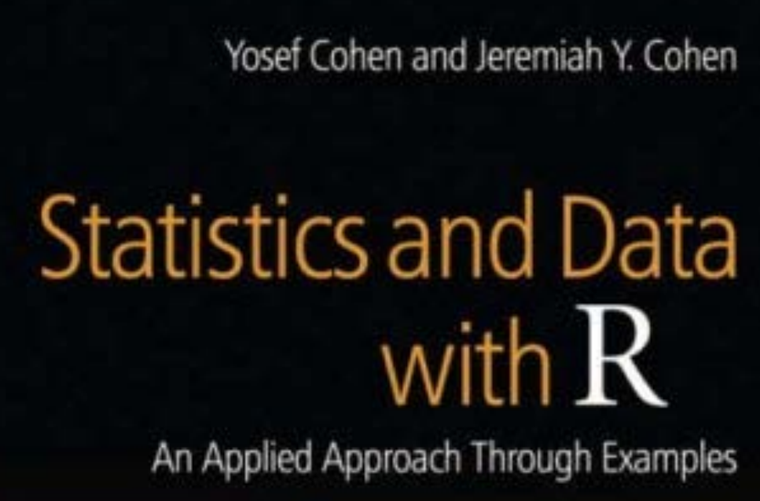

```{r opts, echo = FALSE}
knitr::opts_chunk$set(
    echo = FALSE, message = FALSE, warning = FALSE,
    cache = 2,
    cache.path = "cache_hyp/",
    dev = "png",
    out.width = "500px",
    dpi = 300,
    dev.args = list(
        type = "cairo-png"
    ),
    fig.path = "figure_hyp/"
)
library("ggplot2")
theme_set(theme_bw())
```


```{r, eval = FALSE}
- Pre-reqs: normal distribution
- Experimental design
- Null hypothesis significance test (NHST)
    - Meaning
        - P(res or more extreme|null)
    - Basic theory
    - Basic tests + assumptions/failure modes
        - fisher/chisq/barnard
        - t-test
        - wilcox/mann-whitney
        - correlation
    - Advantages
```

# What will we cover today?

- What do we mean by hypothesis testing?

- Does our experiment allow us to test our hypothesis?

- How can we test our hypothesis?

- What conclusions can we draw from hypothesis testing?

---

# What does hypothesis testing mean?

In the scientific method, from domain knowledge (observations and questions),
we formulate hypotheses about how the world works.

```{r, out.width = "400px"}

```


---

# What does hypothesis testing mean?

A useful hypothesis allows us to make predictions about how the world works
if our hypothesis is true.

```{r, out.width = "400px"}

```

---

# How do we design an experiment to test our hypothesis?

We have a set of known *experimental factors* that we expect to vary.

Primarily, we are interested in one or more **independent variables** that we 
choose to vary, and one or more **dependent variables** that we hope change in 
response to the independent variable.

--

Independent variables:
- genotype
- drug concentration

--

Dependent variables:
- viability
- tumour growth

--

Other experimental (confounding) factors:
- experimental batch
- plate

---

# Why is study design important?

We want to minimise:
- Money

- Time

- Materials

and maximise:

- Certainty (statistical power)

- Hypotheses tested

---

# What is an ideal experimental design?

In an ideal experiment, we ensure that everything other than the independent
variable(s) is exactly fixed in our experiment.

We can then use the observed changes (or lack thereof) in the dependent
variable to inform us about the relationship between the dependent and 
independent variables.

A perfect design is rarely feasible, so it is important to consider how we can 
practically maximise the utility of each experiment.

---


# What is a well-designed experiment?

Sources of bias known and minimised:
- Subjectivity minimised.

- Experimental factors known and controlled.

- Randomisation performed when control is not feasible.

Precise and powerful enough to inform us about our hypothesis:

- Variability minimised.

- Adequately replicated.

---

# Subjectivity

Every experimenter has bias (conscious and unconscious).

It is easy to allow this bias to influence experimental recordings.

When subjective measurments are used, blinding is important.

Whenever possible, objective alternatives should be explored 
(eg, automated cell counting).

```{r, out.width="300px"}

```

---

# Controls

When designing an experiment, it's vital to consider **controls**.

A negative control is a set of observations that we know should not change.

A positive control is one where we know we should observe change.

```{r}

```

---


# Confounding factors

As well as the variable we want to change, we have other experimental factors.

A confounding factor is a factor that is not informative about our hypothesis
and has not been controlled for in our design.

This may mask real associations or generate false associations between
our independent and dependent variables.

--

```{r}

```

GWAS found 150 SNPs predicting exceptional longevity with 77% accuracy.

They used different SNP chips for cases and controls.


---

# Randomisation

It's not always possible to control all variables.

We can't completely process every sample on the same day/plate.

Randomly assign samples to different days/plates to avoid biases.


```{r}

```

---

# Statistical power

Statistical power is the probability that our experiment is able to capture 
real effects in our data.

Statistical power is a function of:

- Effect size

- Variability

- Sample size

- Confidence level
 
---

# Power analysis

Since statistical power is a function of these 4 factors, if we fix or estimate

- Effect size

- Variability

- Confidence level

It's possible to calculate the number of samples we need to have a high
probability of correctly detecting effects.

Mead's resource equation is a guideline to get enough samples to quantify the 
error well. This usually amounts to

- Around 10-20 “degrees of freedom” for simple experiments,
  or 10-20 more samples than groups (WT/KO, treated/untreated, etc).

---

# Effect sizes

When designing experiments, we need to have an idea of the size of effect
we expect to observe.

Smaller effects mean we need more information (more observations) to detect 
them.

Similarly, higher levels of variability (noise) mean that we need more 
observations to reliably detect the same effect size.

```{r, fig.width = 3, fig.height = 3, out.width = "300px"}
ggplot(data.frame(x=0)) +
    aes(x) +
    stat_function(aes(colour="Group 1"), fun = dnorm) +
    stat_function(aes(colour="Group 2"), fun = dnorm, args = c(mean = 1)) +
    xlim(-2, 2) +
    scale_colour_discrete(name = NULL) +
    theme(
        axis.text = element_blank(),
        axis.ticks = element_blank(),
        axis.title = element_blank()
    )
```
```{r, fig.width = 3, fig.height = 3, out.width = "300px"}
ggplot(data.frame(x=0)) +
    aes(x) +
    stat_function(aes(colour="Group 1"), fun = dnorm, args = c(sd = 0.2)) +
    stat_function(aes(colour="Group 2"), fun = dnorm, args = c(mean = 1, sd = 0.2)) +
    xlim(-2, 2) +
    scale_colour_discrete(name = NULL) +
    theme(
        axis.text = element_blank(),
        axis.ticks = element_blank(),
        axis.title = element_blank()
    )
```

---

# Variability

- Technical variability
    
    - Run-to-run variability in processing

    - Instrument error

    - Reagents

    - Operators

- Biological variability
    
    - Difference between animals

    - Time difference

    - Stresses

It's important to understand the sources of variability in an experiment,
and to control and minimise as many as possible.

---


# The importance of replication

Given a single observation, we can compare the values, but we have no idea
if they are similar or different by chance.


```{r, fig.height = 2, fig.width = 4}
set.seed(42)
n <- 1
m1 <- m2 <- 0
x1 <- rnorm(n, m1)
x2 <- rnorm(n, m2)
# p <- t.test(x1, x2)$p.value
df <- data.frame(x1, x2)
mdf <- reshape2::melt(df)
ggplot(mdf) +
    aes(x = value, y = 0, colour = variable) +
    geom_jitter(width = 0, height = 0.2) +
    geom_vline(aes(colour = "x1", xintercept = mean(df$x1))) +
    geom_vline(aes(colour = "x2", xintercept = mean(df$x2)))
```

---

# The importance of replication

With more observations, we gain some idea of how variable our measurements are,
which gives us less uncertainty.


```{r, fig.height = 2, fig.width = 4}
n <- 3
m1 <- m2 <- 0
x1 <- rnorm(n, m1)
x2 <- rnorm(n, m2)
# p <- t.test(x1, x2)$p.value
df <- data.frame(x1, x2)
mdf <- reshape2::melt(df)
ggplot(mdf) +
    aes(x = value, y = 0, colour = variable) +
    geom_jitter(width = 0, height = 0.2) +
    geom_vline(aes(colour = "x1", xintercept = mean(df$x1))) +
    geom_vline(aes(colour = "x2", xintercept = mean(df$x2)))
```

---

# The importance of replication

With a lot of observations, we can become very confident in the precision of
our measurements and the differences between groups.

```{r, fig.height = 2, fig.width = 4}
n <- 10
m1 <- m2 <- 0
x1 <- rnorm(n, m1)
x2 <- rnorm(n, m2)
# p <- t.test(x1, x2)$p.value
df <- data.frame(x1, x2)
mdf <- reshape2::melt(df)
ggplot(mdf) +
    aes(x = value, y = 0, colour = variable) +
    geom_jitter(width = 0, height = 0.2) +
    geom_vline(aes(colour = "x1", xintercept = mean(df$x1))) +
    geom_vline(aes(colour = "x2", xintercept = mean(df$x2)))
```


---

# Planning replication

It's important to estimate the number of replicates we need.

Continuing to generate more data until you get a significant result biases
your inference in a really dangerous way!

```{r, fig.height = 4, fig.width = 5}
set.seed(7)
x <- pval <- numeric(10000)
x[1:2] <- rnorm(2)
for (i in seq_along(x)) { 
    if ((pval[[i]] <- t.test(na.omit(x))$p.value) < 0.05) {
        x <- x[1:i]
        pval <- pval[1:i]
        break
    }
    x[[i]] <- rnorm(1)
}
plot(pval,
    type = "b",
    pch = 16,
    main = paste("p-values of test on null data after", i, "tests")
)
abline(lty = "dashed", h = 0.05)
```

---


# What is statistical inference?

In statistical inference, we want to use a sample to inform us about the
properties of the population.

Using controls and randomisation, we can try to make that sample as 
representative as possible.

```{r, out.width = "300px"}
knitr::include_graphics("figure/population.png")
```


---

# What is hypothesis testing?

Hypothesis testing is a form of statistical inference.

We aim to estimate the probability of observing the data we have, or more 
extreme, if some null hypothesis, $H_0$, was true.

This is usually with reference to an alternative hypothesis, $H_1$.

```{r}

```

---

# What does hypothesis testing tell us?

In hypothesis testing, we ask how likely it would be to observe what we observed
(or more extreme) if our null hypothesis was true.

If it is very unlikely (beyond some threshold, $\alpha$),
we term it a "statistically significant" result.

Important notes:

- The null hypothesis must be realistic.

- Significance testing does not tell us the probability that the null 
  hypothesis is true.

- Significance testing does not tell us the probability that the alternative
  hypothesis is true.

- Significant results do not mean that what we observe is "real" or "important".

- Significance does not necessarily tell us anything about causality.


---

# Probability distribution

A probability distribution is a function that tells us how probable different
outcomes are.

The simplest example is a coin toss - for a fair coin, the probability is 
1/2 for heads and 1/2 for tails.

```{r, fig.width = 4, fig.height = 3}
ggplot() +
    aes(x = c("heads", "tails"), y = c(0.5, 0.5)) +
    geom_col() +
    xlab("Outcome") +
    ylab("Probability") +
    ylim(0, 1)
```

---

# Normal distribution

A distribution indexed by two parameters: mean $\mu$ and variance $\sigma$.

95% of the data lies in $[\mu - 2\sigma, \mu + 2\sigma]$; 99% in $[\mu - 3\sigma, \mu + 3\sigma]$

```{r, fig.width = 4, fig.height = 3}
ggplot(data.frame(x=0)) +
    aes(x) +
    stat_function(aes(colour="mean=0, sd=1"), fun = dnorm) +
    stat_function(aes(colour="mean=1, sd=1"), fun = dnorm, args = c(mean = 1)) +
    stat_function(aes(colour="mean=0, sd=2"), fun = dnorm, args = c(sd = 2)) +
    scale_colour_brewer(palette = "Set1", name = NULL) +
    xlim(-5, 5) +
    labs(x = NULL, y = NULL)
```

---

# Log-normal distribution

In many fields, a log-normal distribution is more common than a normal 
distribution.

A lognormal distribution arises when a normally distributed variable $x$ is 
exponentiated, ie $e^x$.

```{r, fig.width = 4, fig.height = 3}
ggplot(data.frame(x=0)) +
    aes(x) +
    stat_function(aes(colour="mean=0, sd=1"), fun = dlnorm) +
    stat_function(aes(colour="mean=1, sd=1"), fun = dlnorm, args = c(mean = 1)) +
    stat_function(aes(colour="mean=0, sd=2"), fun = dlnorm, args = c(sd = 2)) +
    scale_colour_brewer(palette = "Set1", name = NULL) +
    xlim(0, 15) +
    labs(x = NULL, y = NULL)
```


---

# Hypothesis testing for categorical variables

Given two categorical variables, we can test the hypothesis that they are 
independent.

If two categorical variables are independent, there is no association between
them.

In more concrete terms, there is no over-representation in any cell of a 
contingency table.

What if we want to test the association between gender and vital status?

```{r}
library("GenomicDataCommons")
resp <- cases() %>%
    GenomicDataCommons::filter(~ project.project_id=='TCGA-COAD') %>%
    ids() %>%
    gdc_clinical()
exposures <- resp$exposures
demographic <- resp$demographic
tab <- table(demographic$gender, demographic$vital_status)
knitr::kable(tab, "html")
```

---

# Chi-squared test

First we want to formalise our null hypothesis: that these variables are
independent.

$H_0$: the distribution of vital status is identical in the "male" group and
the "female" group.

$H_1$: the distribution of vital status is different in the "male" group and
the "female" group.

A chi-squared or $\chi^2$ test allows us to determine the probability of
observing the data if gender and vital status are independent.

---

# Chi-squared test

If two variables are independent, we expect observations to fall evenly into
each "bin".

Formally, these are the **expected frequencies** given independence:  

$E_{ij} = N p_i p_j$

where $N$ is the total number of observations, while $p_i$ and $p_j$ are the
probability of observing category $i$ or $j$.


```{r}
N <- nrow(demographic)
e_i <- table(demographic$gender) / N
e_j <- table(demographic$vital_status) / N
e_ij <- matrix(
    c(
        N * e_i[["female"]] * e_j[["Alive"]],
        N * e_i[["male"]] * e_j[["Alive"]],
        N * e_i[["female"]] * e_j[["Dead"]],
        N * e_i[["male"]] * e_j[["Dead"]]
    ),
    nrow = 2
)
colnames(e_ij) <- c("Alive", "Dead")
rownames(e_ij) <- c("female", "male")
e_ij <- round(e_ij, digits = 1)
tab2 <- tab
tab2[] <- paste0(tab, " (", e_ij, ")")
knitr::kable(tab2, "html")
```

Our **test statistic** is the normalised difference between the observed and 
expected counts:

$$
\chi^2 = \sum \frac{(O - E)^2}{E}
$$


---

# Chi-squared test

Under the null hypothesis, the test statistic follows a chi-squared 
distribution. We can use this knowledge to estimate the probability of observing 
the data if the null hypothesis was true.

The p-value of a chi-squared test is the proportion of a chi-squared 
distribution that is as or more extreme than the test statistic we observed:

If this probability is high, as it is here, we cannot reject the null 
hypothesis.

```{r, fig.width = 5, fig.height = 4, out.width = "400px"}
test <- chisq.test(demographic$gender, demographic$vital_status)
chi2 <- test$statistic[[1]]
p <- pchisq(chi2, 1, lower.tail = FALSE)
ggplot(data.frame(x=0)) +
    aes(x) +
    stat_function(fun = dchisq, args = c(df = 1)) +
    scale_x_continuous(limits = c(0, 5), expand = c(0, 0)) +
    coord_cartesian(ylim = c(0, 1.5), expand = FALSE) +
    labs(x = "Value", y = "Density") +
    geom_vline(xintercept = chi2, linetype = "dashed", colour = "grey60") +
    annotate(
        x = 1,
        y = 1,
        label = paste0("p = ", round(p, digits = 2)),
        geom = "text"
    )
```


---

# Alternatives to the chi-squared test

The chi-squared test has a number of assumptions:

- Observations are independent and random samples.

- None of the cells have expected frequency less than 1.

- At least 80% of the cells have expected frequency less than 5.


```{r}
knitr::include_graphics("figure/tea_cups.png")
```

--

In cases where the latter 2 assumptions do not hold, we can use exact tests.
Fisher's exact test is commonly used, but **Barnard's test** is a more powerful 
test.

These tests can be applied to tables larger than 2x2.

---

# Student's t-distribution

The t distribution was developed by William Sealy Gosset during his work as
a brewer and statistician in Guinness.

```{r, out.width = "145px"}

```

The degrees of freedom control how "normal" the distribution is. Higher
values make the distribution more "normal" with lighter tails.

```{r, fig.width = 4, fig.height = 3, out.width = "300px"}
ggplot(data.frame(x=0)) +
    aes(x) +
    stat_function(aes(colour="Normal"), fun = dnorm) +
    stat_function(aes(colour="df=1"), fun = dt, args = c(df = 1)) +
    stat_function(aes(colour="df=2"), fun = dt, args = c(df = 2)) +
    stat_function(aes(colour="df=3"), fun = dt, args = c(df = 3)) +
    xlim(-5, 5)
```

---

# t-test

Say we want to see if the heights of the patients in a cancer genetics study are 
representative of the population.

The average height of the male population in the US is 175.3cm (shown as a grey 
line).

```{r, fig.width = 4, fig.height = 3}
exposures_demographic <- merge(exposures, demographic, by = "case_id")
mean_height <- 175.3 # from wikipedia, US average for males
height <- exposures_demographic$height[exposures_demographic$gender == "male"]
ggplot() +
    aes(height) +
    geom_density(na.rm = TRUE) +
    geom_vline(xintercept = mean_height, linetype = "dashed", colour = "grey80")
```

---

# t-test

We can formulate our hypotheses as follows:

The mean height of male cancer patients, $\mu$ is the same as the mean height 
of the male population of the USA, $\mu_0$:   
$$
H_0: \mu = \mu_0, H_1: \mu \neq \mu_0
$$

Using this hypothesis, we can calculate a test statistic, measuring how
far the mean of our sample, $\bar{x}$, is from $\mu_0$.

$$
t = \frac{\bar{x} - \mu_0}{se(\bar{x})}
$$
where $se(x) = \frac{sd(x)}{\sqrt{n}}$

Under the null hypothesis, this statistic follows a Student t distribution.

---

# t-test

As before, our p-value is a measure of how probable it would be to observe
this value for our test statistic under the null hypothesis.

Here, we can reject the null if $t$ is too large or too small, meaning
that $\mu$ is far from $\mu_0$.

In the case of our example, $t = `r round(test$statistic[[1]], digits = 3)`$.
It's very likely to obtain this value or more extreme under the null hypothesis,
which is reflected in the p-value.

```{r, fig.width = 4, fig.height = 3, out.width = "300px"}
test <- t.test(height, mu = 175.3)
p <- 2 * pt(-abs(test$statistic[[1]]), df = test$parameter[[1]])
ggplot(data.frame(x = 0)) +
    aes(x) +
    stat_function(fun = dt, args = c(df = test$parameter[[1]])) +
    geom_vline(xintercept = test$statistic, linetype = "dashed", colour = "grey60") +
    annotate("text", x = -2.5, y = 0.2,
        label = paste("p =", round(p, digits = 2))) +
    xlim(-5, 5) +
    labs(x = "t statistic", y = "Density")
```

---

# One or two-sided t-test

The previous example was a two-tailed test, meaning we are testing whether
$\mu > \mu_0$ or $\mu < \mu_0$. In some circumstances we only wish to
test whether the mean is greater or less than the population mean.

In this case, the hypotheses are
$$H_0: \mu \geq \mu_0, H_1: \mu < \mu_0$$,
and we focus only on one side of the distribution of the test statistic.


---

# Two sample t-test

Often, we're interested in comparing two populations.
For example say we want to compare the mean heights of female and male subjects 
in our sample.

We can formulate our hypotheses as
$H_0: \mu_1 = \mu_2, H_1: \mu_1 \neq \mu_2$


```{r, fig.width = 4, fig.height = 3}
height_male <- exposures_demographic$height[exposures_demographic$gender == "male"]
height_female <- exposures_demographic$height[exposures_demographic$gender == "female"]
ggplot() +
    geom_density(aes(height_male, fill = "male"), alpha = 0.5, na.rm = TRUE) +
    geom_density(aes(height_female, fill = "female"), alpha = 0.5, na.rm = TRUE) +
    labs(x = "height") +
    scale_fill_brewer(palette = "Set1", name = NULL)
test <- t.test(height_male, height_female)
p <- 2 * pt(-abs(test$statistic[[1]]), df = test$parameter[[1]])

```

---

# Two sample t-test

In the two sample case, the test statistic quantifies the distance between the
observed means:

$$
t = \frac{\bar{x}_A - \bar{x}_B}{se(\bar{x}_A - \bar{x}_B)}
$$

Calculating $se(\bar{x}_A - \bar{x}_B)$ requires us to consider
whether the groups have equal or unequal variance; usually unequal variance is
a safer assumption.

Here, $t = `r round(test$statistic[[1]], digits = 2)`$.
It's very unlikely to observe this value or more extreme under the null 
hypothesis, which is reflected in the p-value.

```{r, fig.width = 4, fig.height = 3, out.width = "300px"}
ggplot(data.frame(x = 0)) +
    aes(x) +
    stat_function(fun = dt, args = c(df = test$parameter[[1]])) +
    geom_vline(xintercept = test$statistic[[1]],
        linetype = "dashed",
        colour = "grey60",
        na.rm = TRUE
    ) +
    annotate("text", x = 5, y = 0.2,
        label = paste("p =", format(p, digits = 2))) +
    xlim(-12, 12) +
    labs(x = "t statistic", y = "Density")
```


---


# t-test assumptions

We can use a t-test when:

- Observations are independent random samples.

- Observations are normally distributed.

--

What if the data aren't normal?

- If $n$ is large (!), a t-test still works using the Central Limit Theorem.

- Try to transform the data (eg, $log(x)$).

- Use a non-parameteric test.

--

What if the data aren't independent?

- Consider a paired t-test if the data are paired (eg, the
  same samples before/after treatment).

- Consider a linear model if the dependence within the data is more complex.

---


# Non-parametric tests

The tests we have described so far are **parametric** in that they formulate
the hypothesis in terms of parameters, and generally assume that the data
follow a distribution (eg, normal) or rely on large sample sizes.

Non-parametric tests are an alternative for when these assumptions are not
met.

---


# One sample sign test

A non-parametric equivalent to the t-test is a sign test.

This uses similar hypotheses to the one sample t-test, but using the median 
in place of the mean:

$$H_0: x_{50\%} = \theta_0, H_1: x_{50\%} \neq \theta_0$$

To compute a test statistic, we compare each observation to $\theta_0$.
If $H_0$ is true, then we expect an equal number of observations larger and 
smaller than $\theta_0$.

Formally, we could say that the sign follows a binomial distribution
with probability 0.5.

---

# Two sample sign test

Non-parametric equivalents to the t-test are the Mann-Whitney U test 
(Wilcoxon rank sum test),
or the Wilcoxon signed rank test, the latter for paired data.

The hypothesis is similar to the one sample sign test,
but in this case we compare the median of each group.

To compute a test statistic, we compare observations between groups.
If $H_0$ is true, then we expect an equal number of observations larger in
group A and smaller in group A.


---

# Considerations

Non-parametric tests typically have fewer assumptions than parametric tests.

This means they may be more widely applicable, and we are less likely to run
into issues when our assumptions are not met.

However, they may be less powerful.

Effect sizes (size of difference) may also be more difficult to obtain.

---

# What if we have more than two groups?

Given more than two groups, we can formulate a null hypothesis as
$H_0: \mu_A = \mu_B = \mu_C \dots$.

The alternative hypothesis is that any one
of these means is not equal to all others.

Using the same assumptions as the t-test, we can test this hypothesis using
ANOVA (parametric) or the Kruskal-Wallis test (non-parametric).

The t-test and ANOVA are both forms of linear model, which will be discussed
in later seminars.

---

# What can go wrong when hypothesis testing?

A lot of misconceptions and misinterpretations circulate surrounding hypothesis
testing, even among researchers with a statistical background.

From the Nature comment, "Scientists rise up against statistical significance":

```{r, out.width="300px"}
knitr::include_graphics("figure/false_conclusions.png")
```
```{r, out.width="300px"}

```

---

# Significance does not always imply causality

Finding a significant relationship between two variables does not imply any 
mechanistic relationship between them. For example, there may be a moderating
variable:

```{r}

```


---

# Significant means important?

Statistically significant differences can be utterly meaningless in terms of
real-world consequence, especially with very large sample sizes.

Vertical lines indicate the means.

```{r, fig.width = 5, fig.height = 4, out.width = "400px"}
library("reshape2")
set.seed(42)
m1 <- 0
m2 <- 0.01
n <- 100000
x1 <- rnorm(n, m1)
x2 <- rnorm(n, m2)
p <- t.test(x1, x2)$p.value
df <- data.frame("Group 1" = x1, "Group 2" = x2, check.names = FALSE)
mdf <- reshape2::melt(df)
ggplot(mdf) +
    aes(value, fill = variable) +
    geom_density(alpha = 0.25) +
    geom_vline(aes(colour = "Group 1", xintercept = m1)) +
    geom_vline(aes(colour = "Group 2", xintercept = m2)) +
    scale_colour_brewer(
        palette = "Set1",
        aesthetics = c("colour", "fill"), 
        name = NULL
    ) +
    annotate("text", x = -0.25, y = 0.2,
        label = paste("n = 100,000\np =", round(p, digits = 3)))
```


---

# Multiple testing

When testing hypotheses, we are estimating how likely we would be to
observe what we have observed, if the null hypothesis is true.

If we repeat this enough times, we will always find some "significant"
results.

```{r, out.width = "275px"}

```


---

# Comparing the result of hypothesis tests

If a hypothesis test for one variable is significant, and a similar test for
another variable is non-significant, this does not tell you about the 
relationship between the two variables.

```{r, fig.width = 5, fig.height = 4}
set.seed(16)
x1 <- rnorm(10, 1)
x2 <- rnorm(10, 0.4)
p1 <- t.test(x1)$p.value
p2 <- t.test(x2)$p.value
df <- data.frame(x1, x2)
mdf <- reshape2::melt(df)
ggplot(mdf) +
    aes(x = variable, y = value, fill = variable) +
    geom_boxplot(alpha = 0.25) +
    stat_compare_means(method = "t.test") +
    scale_fill_discrete(guide = FALSE) +
    annotate("text",
        x = 0.7, y = 2,
        label = paste("p =", format(p1, digits = 3))
    ) +
    annotate("text",
        x = 1.7, y = 2,
        label = paste("p =", format(p2, digits = 3))
    )
```

---

# Alternatives to significance testing

Null hypothesis significance testing ("frequentist" statistics)
does not quantify the evidence in favour of a hypothesis (neither $H_0$ nor 
$H_1$).
It provides negative evidence (it tells us if the null hypothesis is 
unlikely).

Bayesian models, in contrast, can allow us to estimate positive evidence. 

```{r, fig.width = 4, fig.height = 2.5}
library('ggplot2')
library('reshape2')
a0 <- 81
b0 <- 219
hits <- 50
misses <- 250

seq <- seq(0, 1, length.out = 10000)

Prior <- dbeta(seq, a0, b0)
Posterior <- dbeta(seq, a0 + hits, b0 + misses)
Likelihood <- sapply(seq, function(theta) {
  choose(hits + misses, hits) * (theta ^ hits) * ((1 - theta) ^ (misses))
})
Likelihood <- Likelihood / sum(Likelihood)
Posterior <- Posterior / sum(Posterior)
Prior <- Prior / sum(Prior)

df <- data.frame(Prior, Posterior, Likelihood, seq)
mdf <- reshape2::melt(df, id.vars = "seq")
ggplot(mdf, aes(x = seq, color = variable, y = value)) + 
  geom_line() +
  theme_bw() +
  xlab("Batting average") +
  ylab("Density") +
  scale_colour_discrete(name = "") + 
  theme(
    axis.text.y = element_blank(),
    axis.ticks.y = element_blank(),
    )
```

---

# Retrospective power analysis

In some fields, it's common to perform an analysis of statistical power after
an experiment. 

The aim is to find out how much power the experiment had to find the effect size
estimated in the study.

As you can see, this "observed power" is simply a transformation of the p-value.
These *post-hoc* power calculations should be avoided.

See [this CrossValidated post](https://stats.stackexchange.com/a/193783/136282).

```{r, out.width="400px"}

```


---

# Other resources

```{r, out.width="400px"}

```
```{r, out.width="300px"}
knitr::include_graphics("figure/modern_stats_modern_biology.jpg")
```

```{r, out.width="250px"}

```
```{r, out.width="200px"}

```
```{r, out.width="200px"}
knitr::include_graphics("figure/intro_stat_learning.png")
```

---

# Summary

- Experimental design is crucial to allow us to test our hypotheses.

- Poor experimental design can result in spurious results.

- Hypothesis testing allows us to use experimental results to help to 
  falsify hypotheses.

- There are limitations to what hypothesis testing can tell us.

---


# Aside: central limit theorem

A really important theorem in statistics tells us that the mean of repeated 
samples from a population follow a normal distribution.

```{r, fig.height = 3, fig.width = 4, out.width = "250px"}
set.seed(42)
x <- replicate(100, rexp(1000))
mdf <- reshape2::melt(x)
ggplot(mdf) +
    aes(value, colour = factor(Var2)) +
    geom_density() +
    scale_colour_discrete(guide = FALSE)
```

```{r, fig.height = 3, fig.width = 4, out.width = "250px"}
means <- apply(x, 2, mean)
ggplot() +
    aes(means) +
    geom_density()
```
